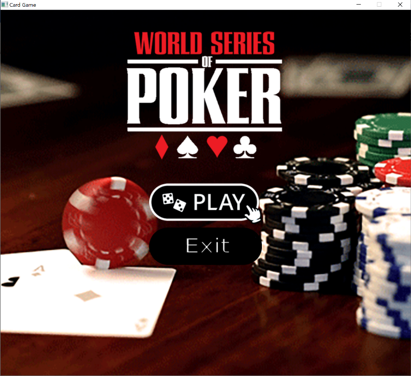

# Card-Game
UCCD2044 Object-Oriented Programming Practices

This program is about how a card game is developed by using Java Programming and Object-Oriented Programming techniques. This game is played by using 52 standard poker cards deck which is 13 ranks of 4 suits. The rules for this game is to compare the numbering on the cards, players that get the largest number will win for that round and get points, there are total 7 rounds, bring the points until the end, the highest scored player will win the game.  

